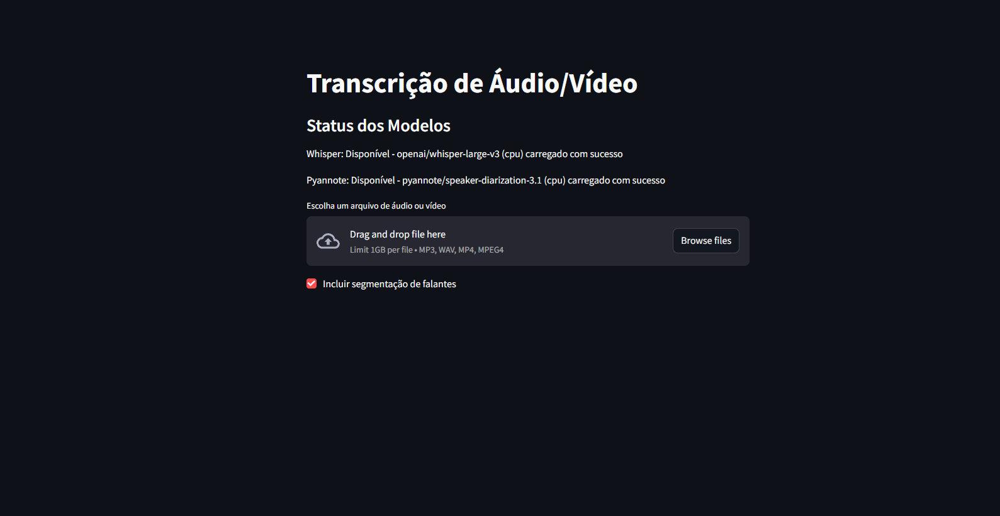

---

<a name="readme-top"></a>

<!-- PROJECT SHIELDS -->
[![Contributors][contributors-shield]][contributors-url]
[![Forks][forks-shield]][forks-url]
[![Stargazers][stars-shield]][stars-url]
[![Issues][issues-shield]][issues-url]
[![MIT License][license-shield]][license-url]
[![LinkedIn][linkedin-shield]][linkedin-url]

<!-- PROJECT LOGO -->
<br />
<div align="center">
  <a href="https://github.com/Dec0XD/audio-transcription-microservices">
    
  </a>
  <h3 align="center">Transcrição de Áudio/Vídeo com Segmentação de Falantes</h3>
  <p align="center">
    Uma aplicação de transcrição de áudio/vídeo com segmentação de falantes, usando uma arquitetura de microserviços com Streamlit, FastAPI, Whisper e Pyannote, otimizada para execução local com suporte a GPU.
    <br />
    <a href="https://github.com/Dec0XD/audio-transcription-microservices"><strong>Explore a documentação »</strong></a>
    <br />
    <br />
    <a href="https://github.com/Dec0XD/audio-transcription-microservices">Ver Demonstração</a>
    ·
    <a href="https://github.com/Dec0XD/audio-transcription-microservices/issues">Reportar Bug</a>
    ·
    <a href="https://github.com/Dec0XD/audio-transcription-microservices/issues">Solicitar Funcionalidade</a>
  </p>
</div>

<!-- TABLE OF CONTENTS -->
<details>
  <summary>Índice</summary>
  <ol>
    <li>
      <a href="#sobre-o-projeto">Sobre o Projeto</a>
      <ul>
        <li><a href="#construído-com">Construído Com</a></li>
      </ul>
    </li>
    <li>
      <a href="#primeiros-passos">Primeiros Passos</a>
      <ul>
        <li><a href="#pré-requisitos">Pré-requisitos</a></li>
        <li><a href="#instalação">Instalação</a></li>
      </ul>
    </li>
    <li><a href="#uso">Uso</a></li>
    <li><a href="#roadmap">Roadmap</a></li>
    <li><a href="#contribuição">Contribuição</a></li>
    <li><a href="#licença">Licença</a></li>
    <li><a href="#contato">Contato</a></li>
    <li><a href="#agradecimentos">Agradecimentos</a></li>
  </ol>
</details>

<!-- ABOUT THE PROJECT -->
## Sobre o Projeto

Esta aplicação permite aos usuários fazer upload de arquivos de áudio ou vídeo, convertê-los para o formato .wav, transcrevê-los usando o modelo Whisper da OpenAI e, opcionalmente, segmentar os falantes com o Pyannote. Construída com uma arquitetura de microserviços, ela separa a lógica de transcrição e diarização em serviços distintos, utilizando FastAPI para os endpoints e Streamlit para uma interface de usuário intuitiva. O projeto é executado localmente em Python, com suporte otimizado para GPUs NVIDIA (ex.: RTX 3060), aproveitando CUDA para acelerar o processamento.

### Por que este projeto?
- Fornece uma solução modular para transcrição de áudio/vídeo com identificação de falantes.
- Otimizado para desempenho com suporte a GPU, ideal para processamentos mais rápidos.
- Interface simples e acessível via Streamlit, com verificação de disponibilidade dos modelos.

Este projeto é perfeito para transcrição de entrevistas, reuniões ou podcasts, oferecendo flexibilidade e desempenho.

<p align="right">(<a href="#readme-top">voltar ao topo</a>)</p>

### Construído Com
- **Python**: Linguagem principal do projeto.
- **Streamlit**: Interface de usuário interativa.
- **FastAPI**: Backend para serviços de transcrição e diarização.
- **Whisper**: Modelo de transcrição de áudio da OpenAI.
- **Pyannote**: Segmentação de falantes.
- **PyTorch com CUDA**: Suporte a GPU para acelerar os modelos.

<p align="right">(<a href="#readme-top">voltar ao topo</a>)</p>

<!-- GETTING STARTED -->
## Primeiros Passos

Siga estas instruções para configurar o projeto localmente.

### Pré-requisitos
- **Python 3.9+**: [Baixe aqui](https://www.python.org/downloads/).
- **Conta no Hugging Face**: Crie uma conta e gere um token de API em [Hugging Face](https://huggingface.co/settings/tokens).
- **FFmpeg**: Necessário para conversão de arquivos. Instale via [ffmpeg.org](https://ffmpeg.org/download.html) e adicione ao PATH.
- **CUDA Toolkit 11.8** (opcional, para GPU): [Baixe aqui](https://developer.nvidia.com/cuda-11-8-0-download-archive) se usar uma GPU NVIDIA.
- **cuDNN** (opcional, para GPU): [Baixe aqui](https://developer.nvidia.com/cudnn) e configure com CUDA 11.8.
- **Driver NVIDIA**: Certifique-se de que o driver mais recente está instalado.

### Instalação
1. **Clone o repositório**:
   ```sh
   git clone https://github.com/Dec0XD/audio-transcription-microservices.git
   cd audio-transcription-microservices
   ```

2. **Crie um ambiente virtual**:
   ```sh
   python -m venv .venv
   .venv\Scripts\activate  # Windows
   ```

3. **Instale as dependências**:
   ```sh
   pip install -r requirements.txt
   ```
   - Para suporte a GPU (CUDA 11.8):
     ```sh
     pip uninstall torch
     pip install torch --index-url https://download.pytorch.org/whl/cu118
     ```

4. **Configure o token do Hugging Face**:
   - Crie um arquivo `.env` na raiz do projeto:
     ```text
     HF_TOKEN=seu_token_aqui
     ```

5. **Inicie os serviços**:
   - Terminal 1: `python transcription_service/whisper_model.py`
   - Terminal 2: `python diarization_service/pyannote_model.py`
   - Terminal 3: `streamlit run frontend/app.py`

6. **Acesse a interface**:
   - Abra o navegador em `http://localhost:8501`.

<p align="right">(<a href="#readme-top">voltar ao topo</a>)</p>

<!-- USAGE EXAMPLES -->
## Uso

1. **Verifique os modelos**:
   - Na interface, veja o status dos modelos Whisper e Pyannote (ex.: "Disponível - openai/whisper-medium (cuda:0)").

2. **Faça upload**:
   - Carregue um arquivo de áudio (.mp3, .wav) ou vídeo (.mp4).

3. **Opções**:
   - Marque "Incluir segmentação de falantes" para identificar quem fala e quando.

4. **Resultado**:
   - Exemplo com segmentação:
     ```
     Número de falantes detectados: 4
     Transcrições por segmento:
     Speaker SPEAKER_01 (4.2s - 5.0s): O João pensou no botão, foi?
     Speaker SPEAKER_00 (6.1s - 9.2s): Sim, ele pensou sim.
     ```

Para mais detalhes, consulte a documentação do projeto.

<p align="right">(<a href="#readme-top">voltar ao topo</a>)</p>

<!-- ROADMAP -->
## Roadmap
- [x] Implementar transcrição com Whisper.
- [x] Adicionar segmentação de falantes com Pyannote.
- [x] Suporte a GPU.
- [ ] Suporte a mais formatos de arquivo (.ogg, .flac).
- [ ] Exportar transcrições como arquivo de texto.
- [ ] Suporte a múltiplos idiomas no Whisper.

Veja as [issues abertas](https://github.com/Dec0XD/audio-transcription-microservices/issues) para mais funcionalidades propostas.

<p align="right">(<a href="#readme-top">voltar ao topo</a>)</p>

<!-- CONTRIBUTING -->
## Contribuição

Contribuições são bem-vindas! Para sugerir melhorias:
1. Faça um fork do repositório.
2. Crie um branch (`git checkout -b feature/NovaFuncionalidade`).
3. Commit suas mudanças (`git commit -m 'Adiciona NovaFuncionalidade'`).
4. Push para o branch (`git push origin feature/NovaFuncionalidade`).
5. Abra um Pull Request.

Dê uma estrela ao projeto se gostar!

<p align="right">(<a href="#readme-top">voltar ao topo</a>)</p>

<!-- LICENSE -->
## Licença

Distribuído sob a licença MIT. Veja `LICENSE.txt` para mais informações.

<p align="right">(<a href="#readme-top">voltar ao topo</a>)</p>

<!-- CONTACT -->
## Contato

André Coêlho - [Intagram](https://www.instagram.com/coelhoandrelucas/) - andrecoedev@gmail.com

Link do Projeto: [https://github.com/Dec0XD/audio-transcription-microservices](https://github.com/Dec0XD/audio-transcription-microservices)

<p align="right">(<a href="#readme-top">voltar ao topo</a>)</p>

<!-- ACKNOWLEDGMENTS -->
## Agradecimentos

- [Streamlit](https://streamlit.io)
- [FastAPI](https://fastapi.tiangolo.com)
- [Whisper](https://huggingface.co/openai)
- [Pyannote](https://huggingface.co/pyannote)
- [PyTorch](https://pytorch.org)
- [NVIDIA CUDA](https://developer.nvidia.com/cuda-toolkit)

<p align="right">(<a href="#readme-top">voltar ao topo</a>)</p>

<!-- MARKDOWN LINKS & IMAGES -->
[contributors-shield]: https://img.shields.io/github/contributors/Dec0XD/audio-transcription-microservices.svg?style=for-the-badge
[contributors-url]: https://github.com/Dec0XD/audio-transcription-microservices/graphs/contributors
[forks-shield]: https://img.shields.io/github/forks/Dec0XD/audio-transcription-microservices.svg?style=for-the-badge
[forks-url]: https://github.com/Dec0XD/audio-transcription-microservices/network/members
[stars-shield]: https://img.shields.io/github/stars/Dec0XD/audio-transcription-microservices.svg?style=for-the-badge
[stars-url]: https://github.com/Dec0XD/audio-transcription-microservices/stargazers
[issues-shield]: https://img.shields.io/github/issues/Dec0XD/audio-transcription-microservices.svg?style=for-the-badge
[issues-url]: https://github.com/Dec0XD/audio-transcription-microservices/issues
[license-shield]: https://img.shields.io/github/license/Dec0XD/audio-transcription-microservices.svg?style=for-the-badge
[license-url]: https://github.com/Dec0XD/audio-transcription-microservices/blob/master/LICENSE.txt
[linkedin-shield]: https://img.shields.io/badge/-LinkedIn-black.svg?style=for-the-badge&logo=linkedin&colorB=555
[linkedin-url]: https://www.linkedin.com/in/andré-coêlho-b55b0622a/

---
